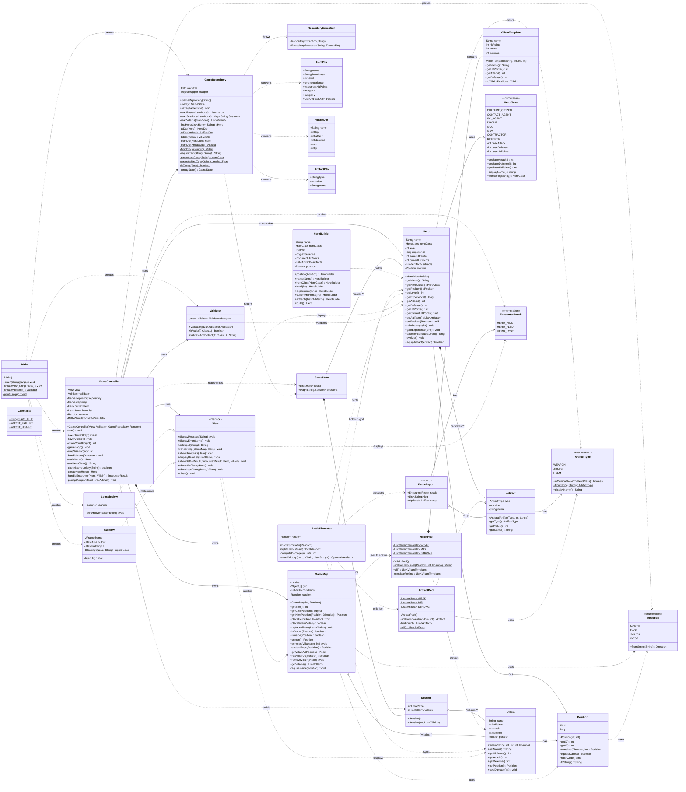

```mermaid
classDiagram
    direction LR

    %% ------------------------------------------------------------------
    %% Entry point
    %% ------------------------------------------------------------------
    class Main {
        -Main()
        +main(String[] args) void$
        -createView(String mode) View$
        -createValidator() Validator$
        -printUsage() void$
    }

    %% ------------------------------------------------------------------
    %% Controller
    %% ------------------------------------------------------------------
    class GameController {
        -View view
        -Validator validator
        -GameRepository repository
        -GameMap map
        -Hero currentHero
        -List~Hero~ heroList
        -Random random
        -BattleSimulator battleSimulator
        +GameController(View, Validator, GameRepository, Random)
        +run() void
        -saveRosterOnly() void
        -saveAndExit() void
        -villainCountFor(int) int
        -gameLoop() void
        -mapSizeFor(int) int
        -handleMove(Direction) void
        -mainMenu() Hero
        -askHeroClass() String
        -checkNameUnicity(String) boolean
        -createNewHero() Hero
        -handleEncounter(Hero, Villain) EncounterResult
        -promptKeepArtifact(Hero, Artifact) void
    }

    %% ------------------------------------------------------------------
    %% Persistence
    %% ------------------------------------------------------------------
    class GameRepository {
        -Path saveFile
        -ObjectMapper mapper
        +GameRepository(String)
        +load() GameState
        +save(GameState) void
        -readRoster(JsonNode) List~Hero~
        -readSessions(JsonNode) Map~String,Session~
        -readVillains(JsonNode) List~Villain~
        -findHero(List~Hero~, String) Hero$
        -toDto(Hero) HeroDto$
        -toDto(Artifact) ArtifactDto$
        -toDto(Villain) VillainDto$
        -fromDto(HeroDto) Hero$
        -fromDto(ArtifactDto) Artifact$
        -fromDto(VillainDto) Villain$
        -requireText(String, String) String$
        -parseHeroClass(String) HeroClass$
        -parseArtifactType(String) ArtifactType$
        -isEmpty(Path) boolean$
        -emptyState() GameState$
    }

    class GameState {
        +List~Hero~ roster
        +Map~String,Session~ sessions
    }

    class Session {
        +int mapSize
        +List~Villain~ villains
        +Session()
        +Session(int, List~Villain~)
    }

    class RepositoryException {
        +RepositoryException(String)
        +RepositoryException(String, Throwable)
    }

    class HeroDto {
        +String name
        +String heroClass
        +int level
        +long experience
        +int currentHitPoints
        +Integer x
        +Integer y
        +List~ArtifactDto~ artifacts
    }

    class VillainDto {
        +String name
        +int hp
        +int attack
        +int defense
        +int x
        +int y
    }

    class ArtifactDto {
        +String type
        +int value
        +String name
    }

    %% ------------------------------------------------------------------
    %% Domain — entities
    %% ------------------------------------------------------------------
    class Hero {
        -String name
        -HeroClass heroClass
        -int level
        -long experience
        -int baseHitPoints
        -int currentHitPoints
        -List~Artifact~ artifacts
        -Position position
        +Hero(HeroBuilder)
        +getName() String
        +getHeroClass() HeroClass
        +getPosition() Position
        +getLevel() int
        +getExperience() long
        +getAttack() int
        +getDefense() int
        +getHitPoints() int
        +getCurrentHitPoints() int
        +getArtifacts() List~Artifact~
        +setPosition(Position) void
        +takeDamage(int) void
        +gainExperience(long) void
        +experienceToNextLevel() long
        -levelUp() void
        +equipArtifact(Artifact) boolean
    }

    class HeroBuilder {
        -String name
        -HeroClass heroClass
        -int level
        -long experience
        -int currentHitPoints
        -List~Artifact~ artifacts
        -Position position
        +position(Position) HeroBuilder
        +name(String) HeroBuilder
        +heroClass(HeroClass) HeroBuilder
        +level(int) HeroBuilder
        +experience(long) HeroBuilder
        +currentHitPoints(int) HeroBuilder
        +artifacts(List~Artifact~) HeroBuilder
        +build() Hero
    }

    class Villain {
        -String name
        -int hitPoints
        -int attack
        -int defense
        -Position position
        +Villain(String, int, int, int, Position)
        +getName() String
        +getHitPoints() int
        +getAttack() int
        +getDefense() int
        +getPosition() Position
        +takeDamage(int) void
    }

    class Artifact {
        -ArtifactType type
        -int value
        -String name
        +Artifact(ArtifactType, int, String)
        +getType() ArtifactType
        +getValue() int
        +getName() String
    }

    class ArtifactPool {
        -List~Artifact~ WEAK$
        -List~Artifact~ MID$
        -List~Artifact~ STRONG$
        -ArtifactPool()
        +rollForPower(Random, int) Artifact$
        -tierFor(int) List~Artifact~$
        +all() List~Artifact~$
    }

    class VillainPool {
        -List~VillainTemplate~ WEAK$
        -List~VillainTemplate~ MID$
        -List~VillainTemplate~ STRONG$
        -VillainPool()
        +rollForHeroLevel(Random, int, Position) Villain$
        +all() List~VillainTemplate~$
        -templateFor(int) List~VillainTemplate~$
    }

    class VillainTemplate {
        -String name
        -int hitPoints
        -int attack
        -int defense
        -VillainTemplate(String, int, int, int)
        +getName() String
        +getHitPoints() int
        +getAttack() int
        +getDefense() int
        +toVillain(Position) Villain
    }

    %% ------------------------------------------------------------------
    %% Domain — map
    %% ------------------------------------------------------------------
    class GameMap {
        -int size
        -Object[][] grid
        -List~Villain~ villains
        -Random random
        +GameMap(int, Random)
        +getSize() int
        +getCell(Position) Object
        +getNextPosition(Position, Direction) Position
        +placeHero(Hero, Position) void
        +placeVillain(Villain) boolean
        +replaceVillains(List~Villain~) void
        +isBorder(Position) boolean
        +isInside(Position) boolean
        +center() Position
        +generateVillains(int, int) void
        -randomEmptyPosition() Position
        +getVillainAt(Position) Villain
        +hasVillainAt(Position) boolean
        +removeVillain(Villain) void
        +getVillains() List~Villain~
        -requireInside(Position) void
    }

    class Position {
        -int x
        -int y
        +Position(int, int)
        +getX() int
        +getY() int
        +translate(Direction, int) Position
        +equals(Object) boolean
        +hashCode() int
        +toString() String
    }

    %% ------------------------------------------------------------------
    %% Domain — battle
    %% ------------------------------------------------------------------
    class BattleSimulator {
        -Random random
        +BattleSimulator(Random)
        +fight(Hero, Villain) BattleReport
        -computeDamage(int, int) int
        -awardVictory(Hero, Villain, List~String~) Optional~Artifact~
    }

    class BattleReport {
        <<record>>
        +EncounterResult result
        +List~String~ log
        +Optional~Artifact~ drop
    }

    %% ------------------------------------------------------------------
    %% Domain — enums
    %% ------------------------------------------------------------------
    class HeroClass {
        <<enumeration>>
        CULTURE_CITIZEN
        CONTACT_AGENT
        SC_AGENT
        DRONE
        GCU
        GSV
        CONTRACTOR
        REFERER
        -int baseAttack
        -int baseDefense
        -int baseHitPoints
        +getBaseAttack() int
        +getBaseDefense() int
        +getBaseHitPoints() int
        +displayName() String
        +fromString(String) HeroClass$
    }

    class ArtifactType {
        <<enumeration>>
        WEAPON
        ARMOR
        HELM
        +isCompatibleWith(HeroClass) boolean
        +fromString(String) ArtifactType$
        +displayName() String
    }

    class Direction {
        <<enumeration>>
        NORTH
        EAST
        SOUTH
        WEST
        +fromString(String) Direction$
    }

    class EncounterResult {
        <<enumeration>>
        HERO_WON
        HERO_FLED
        HERO_LOST
    }

    %% ------------------------------------------------------------------
    %% View
    %% ------------------------------------------------------------------
    class View {
        <<interface>>
        +displayMessage(String) void
        +displayError(String) void
        +askInput(String) String
        +renderMap(GameMap, Hero) void
        +showHeroStats(Hero) void
        +displayHeroList(List~Hero~) void
        +showBattleResult(EncounterResult, Hero, Villain) void
        +showWinDialog(Hero) void
        +showLossDialog(Hero, Villain) void
        +close() void
    }

    class ConsoleView {
        -Scanner scanner
        -printHorizontalBorder(int) void
    }

    class GuiView {
        -JFrame frame
        -JTextArea output
        -JTextField input
        -BlockingQueue~String~ inputQueue
        -buildUi() void
    }

    %% ------------------------------------------------------------------
    %% Validation & util
    %% ------------------------------------------------------------------
    class Validator {
        -javax.validation.Validator delegate
        +Validator(javax.validation.Validator)
        +isValid(T, Class...) boolean
        +validateAndCollect(T, Class...) String
    }

    class Constants {
        +String SAVE_FILE$
        +int EXIT_FAILURE$
        +int EXIT_USAGE$
    }

    %% ==================================================================
    %% Relationships
    %% ==================================================================

    %% Entry point
    Main ..> GameController : creates
    Main ..> ConsoleView : creates
    Main ..> GuiView : creates
    Main ..> GameRepository : creates
    Main ..> Validator : creates

    %% Controller wiring
    GameController --> View : uses
    GameController --> Validator : uses
    GameController --> GameRepository : uses
    GameController --> GameMap : owns
    GameController --> Hero : currentHero
    GameController *-- BattleSimulator : owns
    GameController ..> GameState : reads/writes
    GameController ..> Session : builds
    GameController ..> Direction : parses
    GameController ..> EncounterResult : handles

    %% Persistence
    GameRepository ..> GameState : returns
    GameRepository ..> RepositoryException : throws
    GameRepository ..> HeroDto : converts
    GameRepository ..> VillainDto : converts
    GameRepository ..> ArtifactDto : converts
    GameState *-- Session : contains
    Session o-- Villain : "villains *"
    GameState o-- Hero : "roster *"

    %% Domain composition
    Hero *-- Artifact : "artifacts *"
    Hero --> Position : has
    Hero --> HeroClass : uses
    Hero ..> ArtifactType : filters
    HeroBuilder ..> Hero : builds

    Villain --> Position : has

    Artifact --> ArtifactType : has

    ArtifactPool ..> Artifact : creates
    ArtifactPool ..> ArtifactType : uses

    VillainPool *-- VillainTemplate : contains
    VillainPool ..> Villain : creates

    %% Map
    GameMap o-- Villain : "villains *"
    GameMap ..> Hero : holds in grid
    GameMap ..> Position : uses
    GameMap ..> Direction : uses
    GameMap ..> VillainPool : uses to spawn

    Position ..> Direction : uses

    %% Battle
    BattleSimulator ..> Hero : fights
    BattleSimulator ..> Villain : fights
    BattleSimulator ..> BattleReport : produces
    BattleSimulator ..> ArtifactPool : rolls loot
    BattleReport --> EncounterResult : has
    BattleReport o-- Artifact : drop

    %% View hierarchy
    ConsoleView ..|> View : implements
    GuiView ..|> View : implements
    View ..> GameMap : renders
    View ..> Hero : displays
    View ..> Villain : displays
    View ..> EncounterResult : displays

    %% Validation
    Validator ..> Hero : validates
```