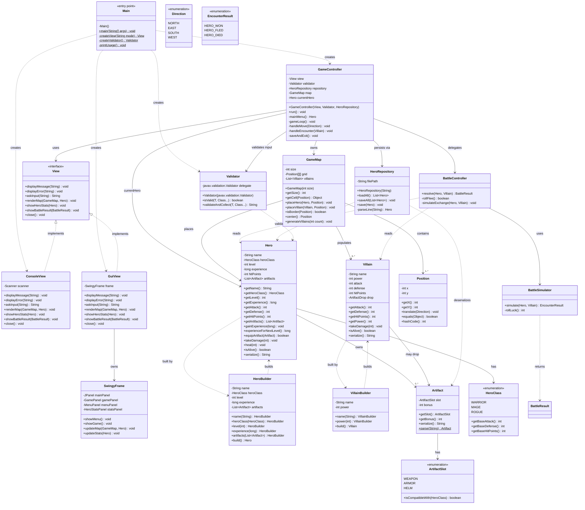

```mermaid
classDiagram
    %% ============================================================
    %%  ENTRY POINT
    %% ============================================================
    class Main {
        <<entry point>>
        -Main()
        +main(String[] args) void$
        -createView(String mode) View$
        -createValidator() Validator$
        -printUsage() void$
    }

    %% ============================================================
    %%  CONTROLLER LAYER
    %% ============================================================
    class GameController {
        -View view
        -Validator validator
        -HeroRepository repository
        -GameMap map
        -Hero currentHero
        +GameController(View, Validator, HeroRepository)
        +run() void
        -mainMenu() Hero
        -gameLoop() void
        -handleMove(Direction) void
        -handleEncounter(Villain) void
        -saveAndExit() void
    }

    class BattleController {
        +resolve(Hero, Villain) BattleResult
        -rollFlee() boolean
        -simulateExchange(Hero, Villain) void
    }

    %% ============================================================
    %%  VIEW LAYER
    %% ============================================================
    class View {
        <<interface>>
        +displayMessage(String) void
        +displayError(String) void
        +askInput(String) String
        +renderMap(GameMap, Hero) void
        +showHeroStats(Hero) void
        +showBattleResult(BattleResult) void
        +close() void
    }

    class ConsoleView {
        -Scanner scanner
        +displayMessage(String) void
        +displayError(String) void
        +askInput(String) String
        +renderMap(GameMap, Hero) void
        +showHeroStats(Hero) void
        +showBattleResult(BattleResult) void
        +close() void
    }

    class GuiView {
        -SwingyFrame frame
        +displayMessage(String) void
        +displayError(String) void
        +askInput(String) String
        +renderMap(GameMap, Hero) void
        +showHeroStats(Hero) void
        +showBattleResult(BattleResult) void
        +close() void
    }

    class SwingyFrame {
        -JPanel mainPanel
        -GamePanel gamePanel
        -MenuPanel menuPanel
        -HeroStatsPanel statsPanel
        +showMenu() void
        +showGame() void
        +updateMap(GameMap, Hero) void
        +updateStats(Hero) void
    }

    %% ============================================================
    %%  MODEL — ENTITIES
    %% ============================================================
    class Hero {
        -String name
        -HeroClass heroClass
        -int level
        -long experience
        -int hitPoints
        -List~Artifact~ artifacts
        +getName() String
        +getHeroClass() HeroClass
        +getLevel() int
        +getExperience() long
        +getAttack() int
        +getDefense() int
        +getHitPoints() int
        +getArtifacts() List~Artifact~
        +gainExperience(long) void
        +experienceForNextLevel() long
        +equipArtifact(Artifact) boolean
        +takeDamage(int) void
        +heal(int) void
        +isAlive() boolean
        +serialize() String
    }

    class HeroBuilder {
        -String name
        -HeroClass heroClass
        -int level
        -long experience
        -List~Artifact~ artifacts
        +name(String) HeroBuilder
        +heroClass(HeroClass) HeroBuilder
        +level(int) HeroBuilder
        +experience(long) HeroBuilder
        +artifacts(List~Artifact~) HeroBuilder
        +build() Hero
    }

    class Villain {
        -String name
        -int power
        -int attack
        -int defense
        -int hitPoints
        -ArtifactDrop drop
        +getAttack() int
        +getDefense() int
        +getHitPoints() int
        +getPower() int
        +takeDamage(int) void
        +isAlive() boolean
        +serialize() String
    }

    class VillainBuilder {
        -String name
        -int power
        +name(String) VillainBuilder
        +power(int) VillainBuilder
        +build() Villain
    }

    class Artifact {
        -ArtifactSlot slot
        -int bonus
        +getSlot() ArtifactSlot
        +getBonus() int
        +serialize() String
        +parse(String) Artifact$
    }

    %% ============================================================
    %%  MODEL — ENUMS
    %% ============================================================
    class HeroClass {
        <<enumeration>>
        WARRIOR
        MAGE
        ROGUE
        +getBaseAttack() int
        +getBaseDefense() int
        +getBaseHitPoints() int
    }

    class ArtifactSlot {
        <<enumeration>>
        WEAPON
        ARMOR
        HELM
        +isCompatibleWith(HeroClass) boolean
    }

    class Direction {
        <<enumeration>>
        NORTH
        EAST
        SOUTH
        WEST
    }

    %% ============================================================
    %%  MODEL — MAP
    %% ============================================================
    class GameMap {
        -int size
        -Position[][] grid
        -List~Villain~ villains
        +GameMap(int size)
        +getSize() int
        +getCell(Position) Object
        +placeHero(Hero, Position) void
        +placeVillain(Villain, Position) void
        +isBorder(Position) boolean
        +center() Position
        +generateVillains(int count) void
    }

    class Position {
        -int x
        -int y
        +getX() int
        +getY() int
        +translate(Direction) void
        +equals(Object) boolean
        +hashCode() int
    }

    %% ============================================================
    %%  MODEL — ENCOUNTER
    %% ============================================================
    class EncounterResult {
        <<enumeration>>
        HERO_WON
        HERO_FLED
        HERO_DIED
    }

    class BattleSimulator {
        +simulate(Hero, Villain) EncounterResult
        -rollLuck() int
    }

    %% ============================================================
    %%  VALIDATION
    %% ============================================================
    class Validator {
        -javax.validation.Validator delegate
        +Validator(javax.validation.Validator)
        +isValid(T, Class...) boolean
        +validateAndCollect(T, Class...) String
    }

    %% ============================================================
    %%  PERSISTENCE
    %% ============================================================
    class HeroRepository {
        -String filePath
        +HeroRepository(String)
        +loadAll() List~Hero~
        +saveAll(List~Hero~) void
        +save(Hero) void
        -parseLine(String) Hero
    }

    %% ============================================================
    %%  RELATIONSHIPS
    %% ============================================================

    %% Entry wiring
    Main ..> GameController : creates
    Main ..> ConsoleView : creates
    Main ..> GuiView : creates
    Main ..> Validator : creates

    %% Controller ↔ View (interface)
    GameController --> View : uses
    GameController --> BattleController : delegates
    GameController --> HeroRepository : persists via
    GameController --> Validator : validates input
    GameController --> GameMap : owns
    GameController --> Hero : currentHero

    %% View implementations
    View <|.. ConsoleView : implements
    View <|.. GuiView : implements
    GuiView --> SwingyFrame : owns

    %% Hero composition
    Hero --> HeroClass : has
    Hero --> "0..*" Artifact : owns
    Hero ..> HeroBuilder : built by
    HeroBuilder ..> Hero : builds

    %% Villain composition
    Villain ..> VillainBuilder : built by
    VillainBuilder ..> Villain : builds
    Villain --> Artifact : may drop

    %% Artifact wiring
    Artifact --> ArtifactSlot : has

    %% Map wiring
    GameMap --> "1..*" Position : contains
    GameMap --> "0..*" Villain : populates
    GameMap --> Hero : places

    %% Battle
    BattleController --> BattleSimulator : uses
    BattleSimulator ..> BattleResult : returns
    BattleController ..> Hero : reads
    BattleController ..> Villain : reads

    %% Persistence
    HeroRepository ..> Hero : serializes
    HeroRepository ..> Artifact : deserializes

    %% Validation
    Validator ..> Hero : validates


```